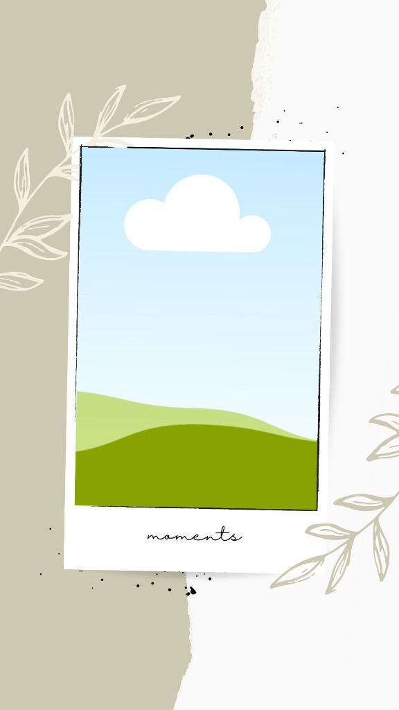
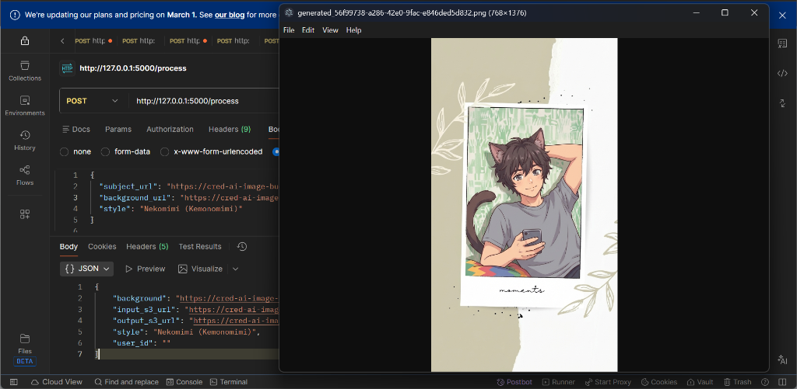
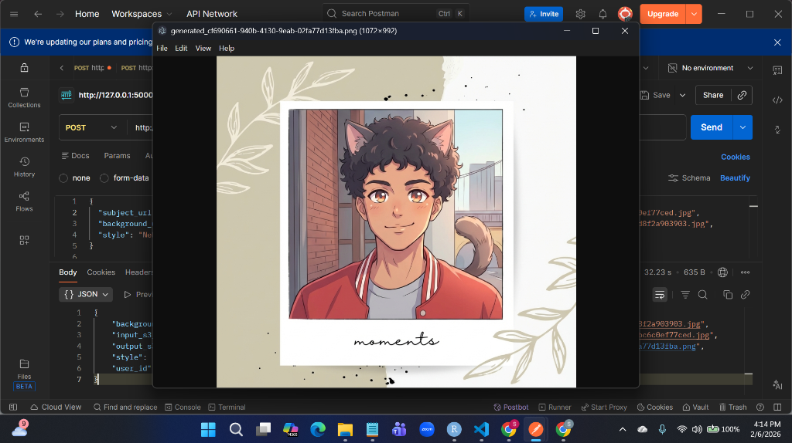

# 🎨 Cred AI Image Builder

> **Turn your photos into anime-style memories.**
> Powered by Google Gemini 1.5 Pro & AWS S3.


---

## 🌟 Overview

**Cred AI Image Builder** is a powerful pipeline that transforms everyday photos into stunning anime-style illustrations. By leveraging advanced generative AI, it seamlessly blends your subject into a "Moment" polaroid-style frame, creating a unique, shareable memory card.

## 🚀 Key Features

*   **✨ Style Transfer**: Convert real photos into 6+ distinct anime styles (Nekomimi, Shonen, Ghibli, etc.).
*   **🖼️ Smart Integration**: Naturally blends characters into background frames.
*   **☁️ Cloud Native**: Fully integrated with AWS S3 for secure and scalable asset storage.
*   **🧠 GenAI Powered**: Uses Google's state-of-the-art Gemini 1.5 Pro Vision model.

---

## 🎨 Visual Showcase

See the magic in action.

### 1. The Inputs
**Your Subject**
| Subject A | Subject B |
| :---: | :---: |
|  |  |

**The Background Frame**


### 2. The Result
**Standard Output**
| Generated 1 | Generated 2 |
| :---: | :---: |
|  |  |

---

## 🛠️ Setup & Installation

Follow these steps to get the server running locally.

### 1. Clone & Install
```bash
# Clone the repository
git clone https://github.com/Jha-Shivam-602/Cread_AI.git
cd Cread_AI

# Install dependencies
pip install -r server/requirements.txt
```

### 2. Configure Environment
Create a `.env` file in the `server/` directory:
```env
GOOGLE_API_KEY=your_gemini_api_key
AWS_ACCESS_KEY_ID=your_aws_access_key
AWS_SECRET_ACCESS_KEY=your_aws_secret_key
```

### 3. Run Server
```bash
cd server
python api.py
# Server runs at http://127.0.0.1:5000
```

---

## 🔌 API Usage

Interact with the API using cURL or Postman.

### 📤 1. Upload Assets
**Upload Subject**
```bash
curl -X POST -F "file=@assets/subject_sample_1.png" http://127.0.0.1:5000/upload
```
*Response: Returns a JSON with `url`. Save this.*

**Upload Background**
```bash
curl -X POST -F "file=@assets/frame_sample.jpg" http://127.0.0.1:5000/upload
```

### 🎨 2. Generate Image
```bash
curl -X POST http://127.0.0.1:5000/process \
-H "Content-Type: application/json" \
-d '{
    "subject_url": "YOUR_SUBJECT_S3_URL",
    "background_url": "YOUR_BACKGROUND_S3_URL",
    "style": "ghibli_japanese_anime"
}'
```

---

## 🎭 Supported Styles

| Style Key | Description |
| :--- | :--- |
| `nekomimi_anime` | 🐱 **Nekomimi** (Cat Ears) |
| `shonen_anime` | ⚔️ **Shonen** (Action/Battle) |
| `kawaii_anime` | 🎀 **Kawaii** (Cute/Chibi) |
| `mushoku_tensei_anime` | 🏰 **Fantasy** (Mushoku Tensei) |
| `ghibli_japanese_anime` | 🍃 **Ghibli** (Whimsical/Soft) |
| `shojo_anime` | 🌸 **Shojo** (Romance/Dreamy) |

---

Made with ❤️ by Shivam Jha
